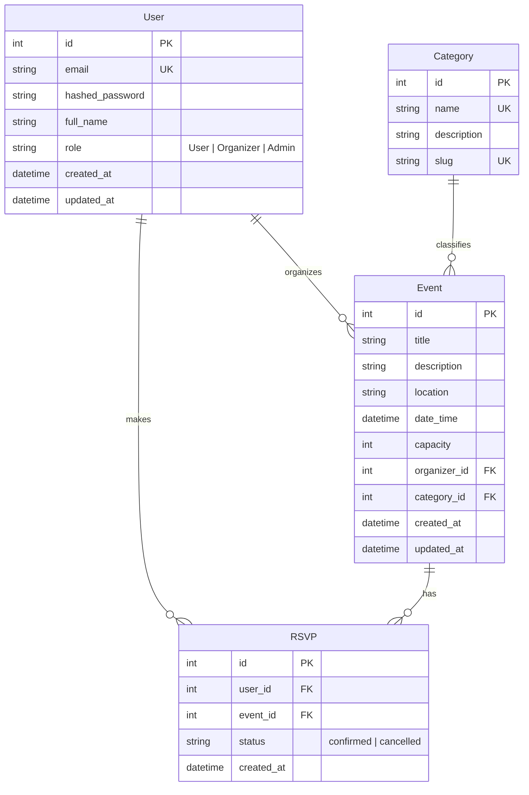

# 🌐 EventSphere: Production-Ready Event Management Platform

EventSphere is a high-performance, production-ready backend-focused Event Management Platform built with **Python 3.11+**, **FastAPI**, **PostgreSQL**, and **SQLAlchemy ORM**. 

This repository has been designed with clean, modular architecture principles (separation of concerns, service objects, dependencies injection) to serve as a robust coding showcase and portfolio project.

---

## 🚀 Key Features

*   **🔒 Secure JWT Authentication**: Full user registration, password verification with Bcrypt hashing, expiration claims, and custom role authorization middleware (`User` / `Organizer` / `Admin`).
*   **⚡ Comprehensive Events CRUD**: Custom event creation, ownership verification rules, and automated slug generation for Categories.
*   **🎟️ Transactional RSVP System**: Double-booking prevention using SQL composite unique constraints, capacity threshold checks, and event relationship mappings.
*   **✉️ Dual-Mode Email Integration**: Configurable email handler with support for **SMTP relay**, **Resend HTTP API**, and a local **Console Mock** for developer testing.
*   **📊 Administration Dashboard API**: Moderation endpoints, aggregate platform metrics, and user/event details.
*   **🐳 Containerized Deployment**: Multi-stage `Dockerfile` and a local `docker-compose.yml` service mesh.
*   **🧪 Fully Covered Test Suite**: Mocked testing environment using an in-memory SQLite database and isolated client dependencies.

---

## 📁 Repository Structure

```
EventSphere-AI/
├── app/
│   ├── main.py                # App entrypoint and configuration
│   ├── core/                  # Configuration loaders, security logic (JWT/Bcrypt)
│   ├── database/              # SQLAlchemy sessions, ORM engine, connection hooks
│   ├── models/                # Database entities (User, Event, RSVP, Category)
│   ├── schemas/               # Pydantic request/response payloads
│   ├── routers/               # Route endpoints (Auth, Events, RSVP, Admin)
│   ├── services/              # Business logic (User, Event, RSVP, Email services)
│   ├── middleware/            # Custom HTTP execution-time logger
│   └── tests/                 # Full integration test suite
├── migrations/                # Alembic version schemas
├── scripts/
│   └── seed.py                # Database seeding script
├── Dockerfile                 # Container image builder
├── docker-compose.yml         # Local container conductor
├── requirements.txt           # Package dependencies
└── .env                       # Local environment configurations
```

---

## 🗺️ Relational Database Design



---

## 🛠️ Local Setup Guide

Follow these steps to get EventSphere running on your local machine:

### 1. Prerequisite Installations
Make sure you have **Python 3.11+** and **Pip** installed on your system.

### 2. Clone and Setup Environment
Navigate into the workspace and create a virtual environment:
```bash
# Create Virtual Environment
python -m venv venv

# Activate Virtual Environment (Windows)
.\venv\Scripts\activate

# Activate Virtual Environment (macOS/Linux)
source venv/bin/activate
```

Install the dependencies:
```bash
pip install -r requirements.txt
```

Verify your `.env` settings are aligned with your development environment.

### 3. Run Database Seeding
To initialize your local SQLite or PostgreSQL database and populate it with initial data, run:
```bash
python scripts/seed.py
```
This script does the following:
*   Creates all required database tables.
*   Populates standard categories (`Technology`, `Music`, `Sports`, etc.).
*   Creates three default testing accounts:
    *   **Admin**: `admin@eventsphere.com` / `adminpassword`
    *   **Organizer**: `organizer@eventsphere.com` / `organizerpassword`
    *   **User**: `user@eventsphere.com` / `userpassword`
*   Creates a mock event managed by the organizer.

### 4. Start the Application Server
Run the FastAPI development server:
```bash
uvicorn app.main:app --reload
```
You can now access:
*   **Web portal & Dashboard**: [http://localhost:8000/](http://localhost:8000/)
*   **Interactive Swagger Documentation**: [http://localhost:8000/docs](http://localhost:8000/docs)
*   **Alternative ReDoc Explorer**: [http://localhost:8000/redoc](http://localhost:8000/redoc)

---

## 🐳 Docker Deployment Setup

For quick, isolated local verification using **Docker Compose**:
```bash
# Build and run containers
docker-compose up --build
```
This spins up:
1.  A PostgreSQL 15 database on port `5432`.
2.  The FastAPI EventSphere backend API on port `8000` (auto-generating tables on startup).

---

## 🧪 Testing with Pytest

To run the integration tests:
```bash
# Execute test suite
pytest -v
```
All tests use a temporary, isolated, in-memory SQLite database, guaranteeing zero side-effects on your development database.
